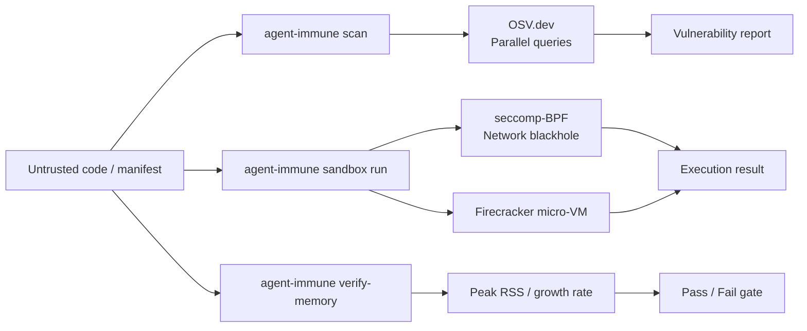

# agent-immune — Security Organ for the Autonomic Ecosystem

**Dependency vulnerability scanning, OSV.dev integration, sandboxed execution (seccomp/Firecracker), and memory safety verification.**

agent-immune is the **immune system** of the Autonomic AI ecosystem. It scans dependency manifests (Cargo.toml, package.json, requirements.txt) against the OSV.dev vulnerability database, executes untrusted code in network-isolated sandboxes with seccomp-BPF or Firecracker, and detects runaway memory growth in generated scripts.

The key design: **defense in depth across three layers** — static analysis (OSV scanning), runtime isolation (sandboxed execution), and behavioral monitoring (memory growth verification). Each layer is independently useful and all three compose for zero-trust agent workflows.

---

## Core Concept

AI agents generate code — and generated code is untrusted code. It might contain malicious instructions, exploit vulnerable dependencies, or enter infinite loops that exhaust memory.

agent-immune provides three safety layers:

1. **Static scanning** — parse dependency manifests, query OSV.dev (parallel, buffer-20 concurrency), report known CVEs before any code runs
2. **Sandboxed execution** — run untrusted scripts in network-isolated environments (subprocess with seccomp, or full Firecracker micro-VM)
3. **Memory verification** — monitor script peak RSS and growth rate to detect OOM-looping or runaway processes



---

## Standalone vs Integrated

| Mode | What you type | What happens |
|------|--------------|--------------|
| **Standalone** | `agent-immune scan ./Cargo.toml` | Parse manifest, query OSV.dev, print vulnerabilities |
| **Standalone** | `agent-immune sandbox run -- echo hello` | Execute in network-isolated subprocess |
| **Standalone** | `agent-immune verify-memory ./script.sh` | Run script and measure memory growth |
| **Integrated** | HTTP daemon on `:3106` | CI and spine integration via REST API |
| **Integrated** | NATS JetStream | Consumes scan and sandbox requests asynchronously |
| **Integrated** | agent-spine | Scan/sandbox results published as domain events |

In standalone mode, immune is a CLI security tool. In integrated mode, it runs as a daemon that agent-spine and agent-muscle query before executing generated code.

---

## Why agent-immune?

| Problem | agent-immune answer |
|---------|-------------------|
| Generated code runs arbitrary shell | **`sandbox run`** — subprocess/Firecracker/seccomp with network isolation |
| Vulnerable dependencies slip into PRs | **`scan`** — Cargo.toml, package.json, requirements.txt → OSV.dev matching |
| Scanning large monorepos is too slow | **Parallel OSV** — concurrent queries with buffer-20 concurrency |
| No memory safety gate for generated scripts | **`verify-memory`** — detect runaway/OOM scripts before production |

---

## What you get

| Feature | Why use it |
|---------|------------|
| **Manifest scanning** | `scan <path>` — Rust/npm/Python deps → OSV vulnerability report |
| **Sandboxed execution** | `sandbox run` — network-isolated, seccomp-BPF or Firecracker |
| **Memory verification** | `verify-memory <script>` — OOM/runaway detection gate |
| **HTTP daemon** | `serve` — CI integration and spine event publishing |
| **Seccomp/Firecracker** | Configurable backends for stronger isolation |

### Sandbox backends

| Backend | Isolation level | Requirements |
|---------|----------------|--------------|
| `process` (default) | Subprocess with network blackhole | None (works everywhere) |
| `seccomp` | seccomp-BPF system call filtering | Linux with seccomp support |
| `firecracker` | Full micro-VM isolation | `AUTONOMIC_FC_KERNEL` + `AUTONOMIC_FC_ROOTFS` env vars |

---

## Commands

| Command | Description |
|---------|-------------|
| `agent-immune scan <path>` | Parse manifests, query OSV.dev, report vulnerabilities |
| `agent-immune sandbox run -- <cmd>` | Execute in configured sandbox backend |
| `agent-immune verify-memory <script>` | Memory growth verification (peak RSS + growth rate) |
| `agent-immune serve` | HTTP API daemon on port 3106 |
| `agent-immune status` | Show config, backends, scanner state |

Global `--progress` (or `AGENT_PROGRESS=1`) enables structured ProgressTree CLI output.

---

## HTTP API

| Method | Endpoint | Description |
|--------|----------|-------------|
| `GET` | `/health` | Daemon health |
| `POST` | `/scan` | Vulnerability scan |
| `POST` | `/sandbox/run` | Sandboxed command execution |

---

## Quick Install

```bash
curl -fsSL https://raw.githubusercontent.com/autonomic-ai-dev/agent-immune/master/scripts/install.sh | bash

# Or full stack:
curl -fsSL https://raw.githubusercontent.com/autonomic-ai-dev/agent-body/master/scripts/install-all-organs.sh | bash
```

Verify:
```bash
agent-immune version
agent-immune status
agent-immune scan ./Cargo.toml
```

---

## Configuration

Section `[immune]` in `~/.autonomic/config.toml` (default port **3106**).

```toml
[immune]
sandbox_backend = "process"    # "process", "seccomp", or "firecracker"
network_blackhole = true
```

---

## Development

```bash
git clone https://github.com/autonomic-ai-dev/agent-immune.git && cd agent-immune
cargo build --release -p agent-immune
cargo test --release -p agent-immune
```

---

## License

MIT
