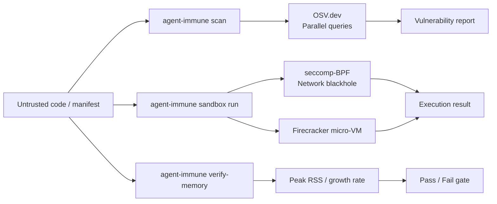

# agent-immune — Zero-Trust Security for the Autonomic Stack

**Cloud-Native role: Admission / policy** (OPA / Gatekeeper analog) — OSV scanning, Firecracker sandboxing, and memory safety verification.

`agent-immune` is the Open Policy Agent (OPA) for the Autonomic cluster. AI agents generate untrusted code. Running that code directly on your host machine is a massive security risk. `agent-immune` enforces strict zero-trust execution boundaries, guaranteeing that rogue agent scripts cannot exfiltrate data, exploit CVEs, or crash your nodes with memory leaks.

---

## Under the Hood: How it Works

### 1. Static Dependency Fuzzing
Before an agent is allowed to execute a newly generated script or package, `agent-immune` intercepts the execution request. It parses the AST and dependency manifests (like `Cargo.toml` or `package.json`) and fuzzes them against the OSV.dev database using a highly concurrent `tokio` query buffer. If a known CVE is detected, execution is immediately rejected.

### 2. Zero-Trust Execution (Firecracker / Seccomp)
When `agent-muscle` actually executes the code, it forces the execution through `agent-immune`'s sandbox. 
Depending on your configuration, `agent-immune` will:
- Wrap the subprocess in strict **seccomp-BPF** profiles to blackhole unauthorized network system calls.
- Boot a full, ephemeral **Firecracker microVM** to execute the script in total isolation, destroying the VM milliseconds after the execution completes.

### 3. Runaway Memory Verification
Agents often write accidental infinite `while` loops that leak memory. `agent-immune` monitors the peak RSS and memory growth rate of the sandboxed script in real-time. If it detects an OOM trajectory, it aggressively kills the process and returns a diagnostic trace to the LLM so it can fix the bug.



---

## Standalone vs Integrated

| Mode | What you type | What happens |
|------|--------------|--------------|
| **Standalone** | `agent-immune scan ./Cargo.toml` | Parse manifest, query OSV.dev, print vulnerabilities |
| **Standalone** | `agent-immune sandbox run -- echo hello` | Execute in network-isolated subprocess |
| **Standalone** | `agent-immune verify-memory ./script.sh` | Run script and measure memory growth |
| **Integrated** | HTTP daemon on `:3106` | CI and spine integration via REST API |
| **Integrated** | NATS JetStream | Consumes scan and sandbox requests asynchronously |
| **Integrated** | agent-spine | Scan/sandbox results published as domain events |

In standalone mode, immune is a CLI security tool. In integrated mode, it runs as a daemon that agent-spine and agent-muscle query before executing generated code.

---

## Why agent-immune?

| Problem | agent-immune answer |
|---------|-------------------|
| Generated code runs arbitrary shell | **`sandbox run`** — subprocess/Firecracker/seccomp with network isolation |
| Vulnerable dependencies slip into PRs | **`scan`** — Cargo.toml, package.json, requirements.txt → OSV.dev matching |
| Scanning large monorepos is too slow | **Parallel OSV** — concurrent queries with buffer-20 concurrency |
| No memory safety gate for generated scripts | **`verify-memory`** — detect runaway/OOM scripts before production |

---

## What you get

| Feature | Why use it |
|---------|------------|
| **Manifest scanning** | `scan <path>` — Rust/npm/Python deps → OSV vulnerability report |
| **Sandboxed execution** | `sandbox run` — network-isolated, seccomp-BPF or Firecracker |
| **Memory verification** | `verify-memory <script>` — OOM/runaway detection gate |
| **HTTP daemon** | `serve` — CI integration and spine event publishing |
| **Seccomp/Firecracker** | Configurable backends for stronger isolation |

### Sandbox backends

| Backend | Isolation level | Requirements |
|---------|----------------|--------------|
| `process` (default) | Subprocess with network blackhole | None (works everywhere) |
| `seccomp` | seccomp-BPF system call filtering | Linux with seccomp support |
| `firecracker` | Full micro-VM isolation | `AUTONOMIC_FC_KERNEL` + `AUTONOMIC_FC_ROOTFS` env vars |

---

## Commands

| Command | Description |
|---------|-------------|
| `agent-immune scan <path>` | Parse manifests, query OSV.dev, report vulnerabilities |
| `agent-immune sandbox run -- <cmd>` | Execute in configured sandbox backend |
| `agent-immune verify-memory <script>` | Memory growth verification (peak RSS + growth rate) |
| `agent-immune serve` | HTTP API daemon on port 3106 |
| `agent-immune status` | Show config, backends, scanner state |

Global `--progress` (or `AGENT_PROGRESS=1`) enables structured ProgressTree CLI output.

---

## HTTP API

| Method | Endpoint | Description |
|--------|----------|-------------|
| `GET` | `/health` | Daemon health |
| `POST` | `/scan` | Vulnerability scan |
| `POST` | `/sandbox/run` | Sandboxed command execution |

---

## Quick Install

```bash
curl -fsSL https://raw.githubusercontent.com/autonomic-ai-dev/agent-immune/master/scripts/install.sh | bash

# Or full stack:
curl -fsSL https://raw.githubusercontent.com/autonomic-ai-dev/agent-body/master/scripts/install-all-organs.sh | bash
```

Verify:
```bash
agent-immune version
agent-immune status
agent-immune scan ./Cargo.toml
```

---

## Configuration

Section `[immune]` in `~/.autonomic/config.toml` (default port **3106**).

```toml
[immune]
sandbox_backend = "process"    # "process", "seccomp", or "firecracker"
network_blackhole = true
```

---

## Development

```bash
git clone https://github.com/autonomic-ai-dev/agent-immune.git && cd agent-immune
cargo build --release -p agent-immune
cargo test --release -p agent-immune
```

---

## License

MIT
