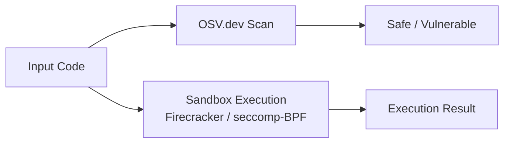

# agent-immune

**Security organ — dependency scanning, sandboxed execution, and seccomp isolation.**

`agent-immune` parses dependency manifests, queries OSV.dev, and runs untrusted code in Firecracker or seccomp-BPF sandboxes.



Standalone: `agent-immune scan .` · Integrated: HTTP daemon on **3106**, spine events on scan/sandbox.

---

## Install

```bash
curl -fsSL https://raw.githubusercontent.com/autonomic-ai-dev/agent-immune/master/scripts/install.sh | bash
```

---

## Quick start

```bash
agent-immune status
agent-immune scan ./my-project
agent-immune sandbox run -- echo hello
agent-immune serve
```

---

## Commands

| Command | Description |
|---------|-------------|
| `scan <path>` | Parse manifests, query OSV.dev |
| `sandbox run` | Execute in configured sandbox backend |
| `serve` | HTTP API daemon |
| `status` | Config and backend settings |

Sandbox backends: `process` (default), `firecracker`, with optional seccomp-BPF.

Firecracker requires `AUTONOMIC_FC_KERNEL` and `AUTONOMIC_FC_ROOTFS`.

---

## HTTP API

| Endpoint | Description |
|----------|-------------|
| `GET /health` | Daemon health |
| `POST /scan` | Vulnerability scan |
| `POST /sandbox/run` | Sandboxed command |

---

## Configuration

Section `[immune]` in `~/.autonomic/config.toml` (default port **3106**).

---

## Development

```bash
cargo test --release -p agent-immune
```

---

## License

MIT
