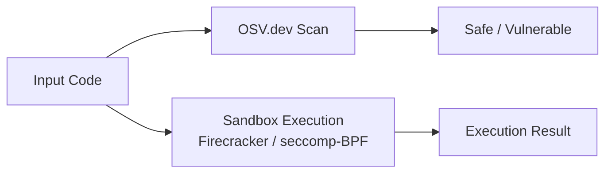

# agent-immune

**Security organ — dependency scanning, sandboxed execution, and seccomp isolation.**

Part of the **[Autonomic AI](https://github.com/autonomic-ai-dev/agent-body)** ecosystem. Parses dependency manifests, queries OSV.dev (concurrent releases parallelize queries), and runs untrusted code in Firecracker or seccomp-BPF sandboxes.

| Standalone | Integrated |
|------------|------------|
| `agent-immune scan .` | HTTP daemon on **3106** |
| `agent-immune sandbox run` | Spine events on scan/sandbox |
| Network blackhole option | `[immune]` in unified config |

---

## Why agent-immune?

| Problem | agent-immune answer |
|---------|-------------------|
| Generated code runs arbitrary shell | **`sandbox run`** — subprocess / Firecracker / seccomp |
| Vulnerable deps slip into PRs | **`scan`** — Cargo.toml, package.json → OSV.dev |
| Scanning large monorepos is slow | **Parallel OSV** — concurrent queries (buffer 20) |
| No memory safety gate | **`verify-memory`** — detect runaway scripts |



---

## Quick Install

```bash
curl -fsSL https://raw.githubusercontent.com/autonomic-ai-dev/agent-immune/master/scripts/install.sh | bash
# or full stack:
curl -fsSL https://raw.githubusercontent.com/autonomic-ai-dev/agent-body/master/scripts/install-all-organs.sh | bash
```

Verify:

```bash
agent-immune version
agent-immune status
agent-immune scan ./Cargo.toml
```

---

## Main features

| Feature | Setup | Why use it |
|---------|-------|------------|
| **Manifest scan** | `scan <path>` | Rust/npm/Python deps → OSV vulnerabilities |
| **Sandbox exec** | `sandbox run` | Network-isolated script execution |
| **Memory verify** | `verify-memory <script>` | OOM/runaway detection gate |
| **HTTP daemon** | `serve` | CI and spine integration |
| **Seccomp / Firecracker** | config backends | Stronger isolation when available |

Sandbox backends: `process` (default), `firecracker`, with optional seccomp-BPF. Firecracker requires `AUTONOMIC_FC_KERNEL` and `AUTONOMIC_FC_ROOTFS`.

---

## Commands

| Command | Description |
|---------|-------------|
| `scan <path>` | Parse manifests, query OSV.dev |
| `sandbox run -- <cmd>` | Execute in configured sandbox backend |
| `verify-memory <script>` | Memory growth verification |
| `serve` | HTTP API daemon |
| `status` | Config and backend settings |

---

## HTTP API

| Endpoint | Description |
|----------|-------------|
| `GET /health` | Daemon health |
| `POST /scan` | Vulnerability scan |
| `POST /sandbox/run` | Sandboxed command |

---

## Configuration

Section `[immune]` in `~/.autonomic/config.toml` (default port **3106**).

---

## Local setup

```bash
git clone https://github.com/autonomic-ai-dev/agent-immune.git && cd agent-immune
cargo build --release -p agent-immune
agent-immune scan .
agent-immune sandbox run -- echo hello
```

---

## Development

```bash
cargo test --release -p agent-immune
```

---

## License

MIT
